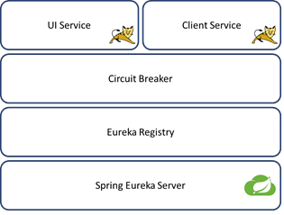

# Circuit Breaker
## Abstract
Using circuit-breaker pattern makes more stability in using micro-service architecture. Spring Cloud implemented this
pattern but using spring cloud dependents to using spring boot, in some project using of spring boot is not possible.
This project created for using circuit-breaker and eureka server without using spring framework.
## How to use
for using of this library you must clone two project form my repository as follow:
```bash
$ git clone https://github.com/alirezakhtm/eureka-registry.git
$ git clone https://github.com/alirezakhtm/circuitbreaker-hystrix.git
```
both above projects must be installed in your maven repository by this commmand:
```bash
$ mvn install
```
following dependencies must be added to your project
```xml
<dependencies>
    <dependency>
        <groupId>com.khtm.eureka</groupId>
        <artifactId>eureka-register</artifactId>
        <version>1.0.0-SNAPSHOT</version>
    </dependency>
    <dependency>
        <groupId>com.khtm.circuitbreaker</groupId>
        <artifactId>circuitbreaker-hystrix</artifactId>
        <version>1.0.0-SNAPSHOT</version>
    </dependency>
</dependencies>
```
> for more information for registering service on Eureka server please read [Eureka-Registry](https://github.com/alirezakhtm/eureka-registry:/)

## Run Example
you must set eureka server url and IPv4 of your PC (or container) in these examples then deploy them on Tomcat standalone.

 